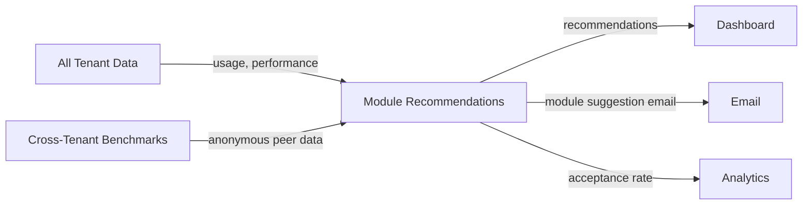

import { Card, CardGrid, LinkCard, Badge, Tabs, TabItem, Steps, Aside } from '@astrojs/starlight/components';

**Recommend which GrowthOS modules to activate next — based on tenant benchmarks and peer data.**

---

## Scoring Card

| Dimension | Score | Rationale |
|-----------|-------|-----------|
| Pain | 2/5 | Tenants don't know what they're missing, but they're not in acute pain |
| Revenue | 2/5 | Drives module activation (internal upsell), not direct revenue |
| Build | 2/5 | Requires cross-tenant analytics, benchmarking pipeline, recommendation logic |
| Moat | 2/5 | Cross-tenant benchmarks are defensible but require scale to be meaningful |
| **Total** | **8/20** | |

---

## Classification

<Badge text="Vitamin" variant="caution" /> <Badge text="AI Layer" variant="default" />

<Aside type="caution" title="Vitamin">
Module recommendations solve a **discovery problem**, not a pain problem. Tenants activate the obvious modules (referrals, email) but miss high-value combinations. This feature acts as a **growth advisor** — surfacing the next-best-action based on what similar successful tenants have done.
</Aside>

---

## The Pain It Kills

Tenants do not know which GrowthOS modules would have the highest impact for their specific stage, industry, and current configuration.

- **Obvious modules get activated first** — referrals, email sequences, waitlist. But the highest-impact module for a B2B SaaS at 500 users might be Upgrade Prompts + Contact Scoring, not another referral variant.
- **No peer benchmarking exists** — a tenant cannot ask "what do other SaaS companies at my stage use?" No growth platform provides this.
- **Module fatigue** — GrowthOS will ship 30+ modules by Phase 3. Without guidance, tenants activate 3–5 and never explore the rest.
- **Internal upsell is manual** — today, module recommendations would require a CSM to analyze each tenant. AI makes this self-serve.

---

## What It Does

<Steps>
1. **Analyze tenant's current state** — which modules are active, usage depth, performance metrics, growth stage, industry vertical.
2. **Compare to successful peers** — anonymous cross-tenant benchmarking identifies which module combinations correlate with the best outcomes for similar tenants.
3. **Recommend next-best-module** — surface 1–3 module recommendations with predicted impact scores and plain-language rationale.
4. **Industry-specific guidance** — recommendations adapt to vertical (B2B SaaS vs. B2C vs. developer tools vs. e-commerce).
5. **Track acceptance rate** — measure how often tenants activate recommended modules, and feed this back into the recommendation model.
</Steps>

---

## Competition & What We Replace

| Tool | Pricing | Limitation |
|------|---------|------------|
| HubSpot upsell prompts | Built-in | Generic upsell, not data-driven peer benchmarking |
| No direct competitor | — | No growth platform offers peer-benchmarked module recommendations |

This is a **greenfield opportunity**. No competitor in the growth platform space offers cross-tenant, anonymized peer benchmarking with module-level recommendations. The closest analogy is AWS Trusted Advisor — but for growth modules instead of cloud infrastructure.

---

## Moat & Defensibility

**Cross-tenant data is the moat (2/5).**

- Recommendations require a critical mass of tenants (300+) to be statistically meaningful. A new competitor starting from zero cannot offer peer benchmarking.
- The moat deepens over time — as more tenants activate more modules, the recommendation model has richer data about which combinations work for which tenant profiles.
- Anonymous benchmarking data is proprietary to GrowthOS and cannot be replicated by integrating third-party tools.

---

## Interoperability Advantage

Module recommendations sit at the **meta-level** — they operate on top of all other modules, analyzing usage patterns and outcomes across the entire GrowthOS ecosystem.

---

## What Ships

- **Next-best-module recommendation** — 1–3 recommended modules with predicted impact scores
- **Peer benchmarking dashboard** — "companies like you" comparison (anonymous, aggregated)
- **Predicted impact scores** — estimated lift from activating the recommended module
- **Industry-specific recommendations** — tailored to B2B SaaS, B2C, developer tools, e-commerce
- **Plain-language rationale** — "72% of B2B SaaS companies at your stage see 15% higher retention after activating Contact Scoring"
- **Recommendation acceptance tracking** — measure and improve recommendation quality over time

---

## What Does NOT Ship

- **Custom recommendation models** — no tenant-facing model tuning; recommendations are fully automated
- **Real-time recommendations** — recommendations update weekly, not in real-time
- **Automatic module activation** — recommendations are suggestions only; tenants must explicitly activate modules
- **Competitor benchmarking** — peer comparisons are within GrowthOS tenants only, not against external platforms

---

## Build vs Buy

**BUILD.**

No off-the-shelf recommendation engine works for this use case — it requires deep knowledge of GrowthOS module semantics, cross-tenant data aggregation, and integration with the dashboard. The ML component is lightweight (collaborative filtering + rule-based logic), but the data pipeline is custom.

**Estimated effort:** 4–5 weeks.

---

## Dependencies

| Dependency | Why |
|-----------|-----|
| 300+ tenants | Statistical significance for peer benchmarking |
| All Phase 1–3 modules | Need diverse module usage data to make meaningful recommendations |
| [Cohort Analytics (P3-20)](/growthos/phase-3/cohort-analytics/) | Tenant performance metrics feed into recommendation model |
| Cross-tenant data pipeline | Anonymous aggregation infrastructure for benchmarking |
