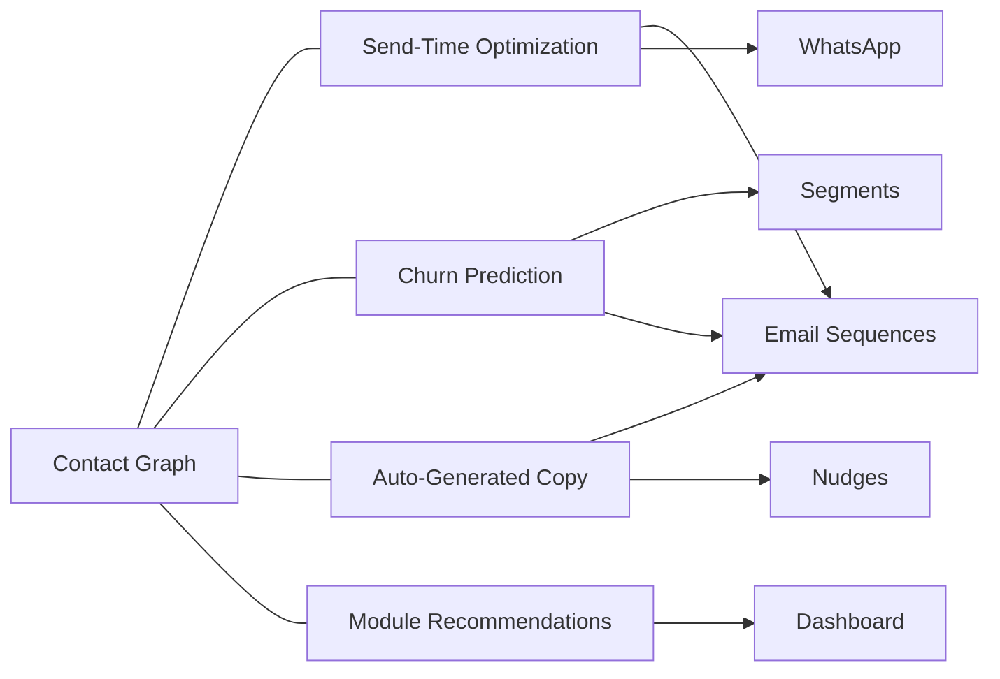

import { Card, CardGrid, LinkCard, Badge, Tabs, TabItem, Steps, Aside } from '@astrojs/starlight/components';

GrowthOS Phase 4 is the **AI Layer** — predictive intelligence built on top of the data foundation established in Phases 1–3. Instead of reacting to user behavior, the platform anticipates it. Send-time optimization, churn prediction, auto-generated copy, and module recommendations transform GrowthOS from a growth toolkit into a growth intelligence engine.

---

## Timeline & Team

| Parameter | Detail |
|-----------|--------|
| **Timeline** | Months 16–20 |
| **Team** | 2–3 ML engineers + existing platform team |
| **Total Engineering** | ~20 weeks |

---

## Entry Trigger

<Aside type="caution" title="Phase 4 begins when ALL conditions are met">
- ≥ 300 tenants on the platform
- ≥ 1M total events ingested across all tenants
- ≥ 3 months of historical data per tenant (median)
</Aside>

---

## Goal

Build **intelligence on top of data** — make GrowthOS predictive, not just reactive. AI features justify **enterprise pricing ($299+/mo)** and create a data moat that deepens with every tenant. The more data flows through GrowthOS, the smarter every module becomes.

---

## Feature Summary

| # | Feature | Pain | Revenue | Build | Moat | Total | Category |
|---|---------|:----:|:-------:|:-----:|:----:|:-----:|----------|
| P4-33 | [Send-Time Optimization](/growthos/phase-4/send-time-optimization/) | 3 | 3 | 2 | 3 | **11** | <Badge text="AI Layer" variant="default" /> |
| P4-34 | [Churn Prediction](/growthos/phase-4/churn-prediction/) | 3 | 3 | 2 | 2 | **10** | <Badge text="AI Layer" variant="default" /> |
| P4-35 | [Auto-Generated Copy](/growthos/phase-4/auto-copy/) | 2 | 2 | 3 | 2 | **9** | <Badge text="AI Layer" variant="default" /> |
| P4-36 | [Module Recommendations](/growthos/phase-4/module-recommendations/) | 2 | 2 | 2 | 2 | **8** | <Badge text="AI Layer" variant="default" /> |

---

## Success Metrics

| Metric | Target |
|--------|--------|
| Paying customers | 300+ |
| MRR | $200K+ |
| AI feature adoption | 30%+ of Scale tier customers |
| Enterprise deals | First enterprise contracts signed |
| Send-time lift | ≥ 15% open rate improvement over batch sends |
| Churn prediction accuracy | ≥ 70% precision at 30-day horizon |

---

## What Makes Phase 4 Special

<Aside type="tip" title="Data Moat Deepens with Every Tenant">
Every AI feature in Phase 4 gets better as more tenants use GrowthOS. Cross-tenant benchmarks (anonymized) power module recommendations. Per-contact engagement history powers send-time optimization. The data moat is **cumulative and compounding** — a competitor launching today would need years of data to match.
</Aside>

Phase 4 features are classified as **Vitamins**, not Painkillers. They enhance an already-working growth stack rather than solving an acute pain. This is intentional — AI features are the upsell lever that justifies enterprise pricing, not the reason a tenant signs up.

---

## Feature Deep Dives

<CardGrid>
  <LinkCard title="P4-33: Send-Time Optimization" href="/growthos/phase-4/send-time-optimization/" description="ML model predicts the optimal send time per contact for maximum open rates." />
  <LinkCard title="P4-34: Churn Prediction" href="/growthos/phase-4/churn-prediction/" description="Predict which users are likely to churn before they cancel — and trigger retention flows." />
  <LinkCard title="P4-35: Auto-Generated Copy" href="/growthos/phase-4/auto-copy/" description="LLM generates email subjects, body copy, and nudge text — tuned to your brand voice." />
  <LinkCard title="P4-36: Module Recommendations" href="/growthos/phase-4/module-recommendations/" description="Recommend which GrowthOS modules to activate next — based on tenant benchmarks and peer data." />
</CardGrid>
