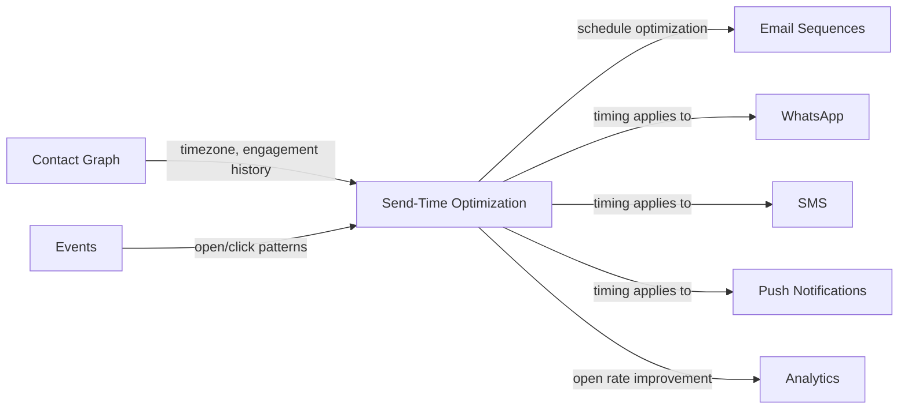

import { Card, CardGrid, LinkCard, Badge, Tabs, TabItem, Steps, Aside } from '@astrojs/starlight/components';

**ML model predicts the optimal send time per contact for maximum open rates.**

---

## Scoring Card

| Dimension | Score | Rationale |
|-----------|-------|-----------|
| Pain | 3/5 | Batch sends ignore recipient habits — measurable open-rate loss |
| Revenue | 3/5 | Justifies Scale/Enterprise tier pricing; clear before/after metric |
| Build | 2/5 | Requires ML pipeline, per-contact modeling, scheduling infrastructure |
| Moat | 3/5 | Model improves with data volume — competitors can't replicate without history |
| **Total** | **11/20** | |

---

## Classification

<Badge text="Vitamin" variant="caution" /> <Badge text="AI Layer" variant="default" />

<Aside type="caution" title="Vitamin">
Send-time optimization enhances an already-working email system. Teams can grow without it, but those who activate it see measurable open-rate lifts. It is a **premium differentiator**, not a must-have — perfect for justifying enterprise pricing.
</Aside>

---

## The Pain It Kills

Emails sent at batch time — 9 AM Tuesday for everyone — ignore the reality that each recipient has different habits. A founder in San Francisco checks email at 8 AM PST. A developer in Bangalore checks at 10 PM IST after dinner.

- **Open rates for batch sends: 15–25%.** Optimal timing pushes this to **25–40%** for engaged contacts.
- Most indie SaaS teams have zero per-contact timing intelligence — they pick a time slot and hope.
- Timezone-aware sending helps but is still coarse — optimal time varies by individual, not just geography.
- Every unread email is a wasted impression. At scale, even a 5% lift in open rates compounds into thousands of additional engaged contacts per month.

---

## What It Does

<Steps>
1. **Analyze per-contact engagement history** — open times, click times, session patterns, timezone data from the Contact Graph.
2. **Build a per-contact optimal send window** — ML model predicts the 1–2 hour window with the highest open probability.
3. **Automatically schedule delivery** — emails, push notifications, and WhatsApp messages are held and released at the predicted optimal time.
4. **Measure and improve** — track open-rate lift per contact, retrain the model weekly as new data arrives.
</Steps>

The system is **timezone-aware by default** and **behavior-aware on top** — it knows not just where a contact is, but when they actually engage.

---

## Competition & What We Replace

| Tool | Pricing | Limitation |
|------|---------|------------|
| Customer.io Send-Time Optimization | Enterprise tier only | Locked behind $1,000+/mo plans |
| Braze Intelligent Timing | $60K+/yr | Enterprise-only, requires massive data volumes |
| Seventh Sense | $80–$450/mo | HubSpot/Marketo only, single-channel (email) |
| Mailchimp Send Time Optimization | Built-in (limited) | Aggregate model, not per-contact — same "best time" for all contacts |

GrowthOS send-time optimization is **per-contact, multi-channel, and included in the Scale tier** — not locked behind enterprise pricing or limited to email only.

---

## Moat & Defensibility

**Data moat (3/5).**

- The model improves with every email sent and every open/click recorded. Six months of per-contact engagement data creates a timing model that a new competitor cannot replicate on day one.
- Cross-channel data (email + push + WhatsApp) makes the model richer than any single-channel optimizer.
- Integration with the [Contact Graph](/growthos/phase-1/unified-contact-graph/) means the model has access to timezone, engagement history, lifecycle stage, and activity patterns — not just email open timestamps.

---

## Interoperability Advantage

Send-time optimization is a **cross-cutting concern** — it enhances every outbound channel, not just email. A single ML model benefits every module that sends messages.

---

## What Ships

- **Per-contact optimal send time prediction** — individualized, not aggregate
- **Automatic scheduling** — emails and messages held until predicted optimal time
- **Timezone-aware baseline** — works from day one, improves with behavioral data
- **Multi-channel support** — email, WhatsApp, SMS, push notifications
- **Improvement metrics dashboard** — before/after open rates, per-contact timing heatmap
- **Weekly model retraining** — model improves automatically as data accumulates

---

## What Does NOT Ship

- **Real-time send** — messages are still batched at the predicted optimal time, not streamed in real-time
- **Per-message ML** — the model is per-contact (predicting best time for a person), not per-message (predicting best time for a specific email)
- **Custom ML model training UI** — no tenant-facing model configuration; the system is fully automated
- **Send-time for transactional emails** — transactional emails (password reset, receipts) bypass optimization and send immediately

---

## Build vs Buy

**BUILD.**

No open-source send-time optimization library exists with multi-tenant support, multi-channel awareness, and Contact Graph integration. The ML model is relatively straightforward (gradient-boosted trees on engagement timestamps), but the scheduling infrastructure and cross-channel integration must be native.

**Estimated effort:** 5–6 weeks.

---

## Dependencies

| Dependency | Why |
|-----------|-----|
| [Contact Graph (P1-01)](/growthos/phase-1/unified-contact-graph/) | Timezone, engagement history, and activity patterns per contact |
| [Lifecycle Emails (P1-03)](/growthos/phase-1/lifecycle-emails/) | Primary channel for send-time optimization |
| Event data (6+ months) | Model requires historical open/click timestamps to make meaningful predictions |
| [WhatsApp (P3-23)](/growthos/phase-3/whatsapp/) | Multi-channel timing optimization |
