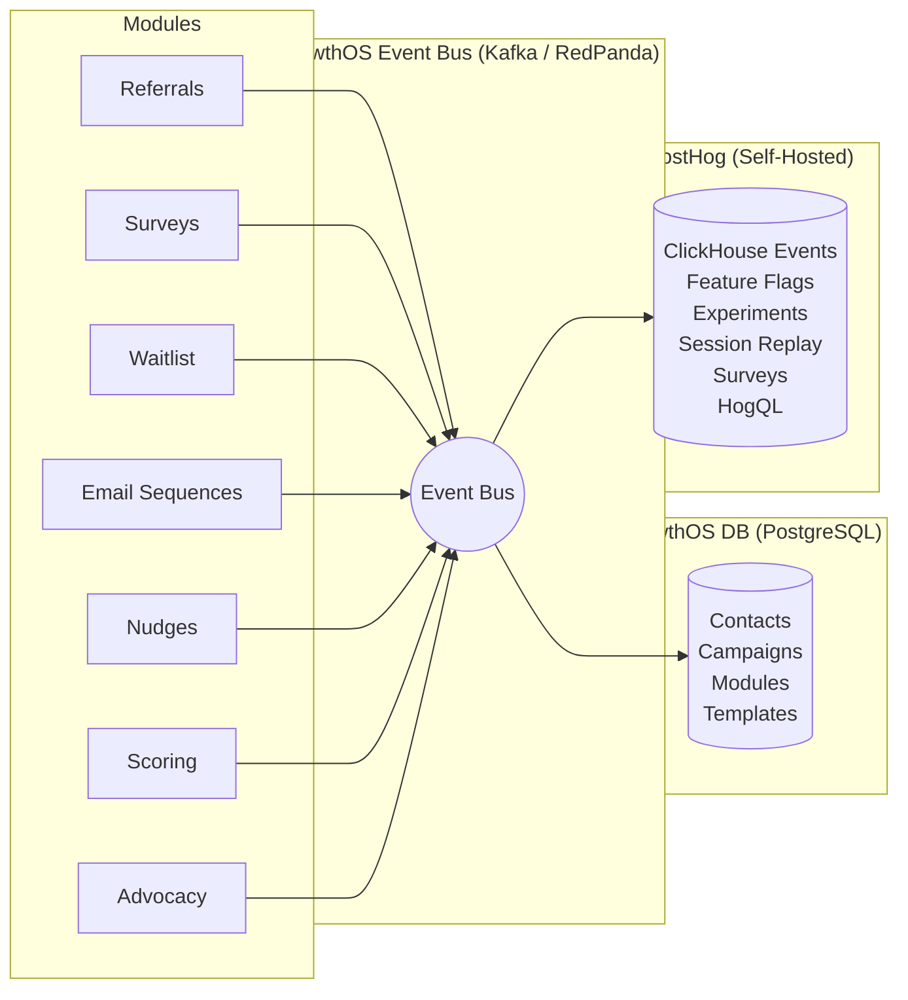
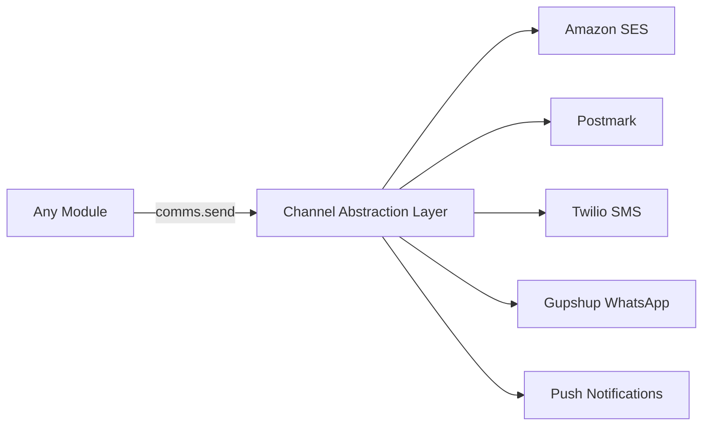

import { Card, CardGrid, LinkCard, Badge, Tabs, TabItem, Steps, Aside } from '@astrojs/starlight/components';

## Architecture Overview

GrowthOS is built around a central **event bus** that connects every growth module to a shared data layer and analytics backbone. Modules never talk to each other directly — they emit events, and the platform routes those events to the right destinations.



Every event follows a canonical schema, gets persisted to PostgreSQL for operational use, and forwarded to PostHog for analytics, feature flags, and experimentation.

---

## Tech Stack Summary

<Tabs>
  <TabItem label="Backend">
    - **Runtime:** Node.js or Python
    - **Framework:** Express or FastAPI
    - **Database:** PostgreSQL with row-level security for multi-tenancy
    - **Event Streaming:** Kafka or RedPanda (self-hosted)
    - **Workflow Orchestration:** Temporal.io for durable, long-running workflows
    - **Email Delivery:** SES or Postmark
  </TabItem>
  <TabItem label="Frontend">
    - **Dashboard:** React (admin and tenant dashboards)
    - **Embeddable Widgets:** Custom Web Components (framework-agnostic)
    - **Build Tooling:** Vite
    - **Component Development:** Storybook
  </TabItem>
  <TabItem label="Infrastructure">
    - **Cloud:** AWS (VPC, RDS, ECS/K8s, CloudFront)
    - **Analytics:** PostHog self-hosted on ClickHouse
    - **CI/CD:** GitHub Actions
    - **Observability:** Prometheus + Grafana
  </TabItem>
</Tabs>

---

## Build vs Integrate Decision Matrix

Every component in GrowthOS goes through a deliberate build-or-buy evaluation. The guiding principle: **build what creates defensible IP, integrate proven FOSS, buy commodity infrastructure.**

| Component | Decision | Rationale |
|---|---|---|
| Contact graph | <Badge text="Build" variant="success" /> | Core IP — unified identity is the moat |
| Event bus | <Badge text="Self-host" variant="note" /> | RedPanda (Kafka-compatible, lower ops overhead) |
| PostgreSQL | <Badge text="Self-host" variant="note" /> | Operational data store with RLS |
| Temporal.io | <Badge text="Self-host" variant="note" /> | Workflow orchestration for sequences and campaigns |
| Analytics | <Badge text="Integrate" variant="caution" /> | PostHog FOSS edition — proven at scale |
| Feature flags | <Badge text="Integrate" variant="caution" /> | PostHog feature flags — already in the stack |
| Email automation | <Badge text="Evaluate" variant="default" /> | Mautic or Laudspeaker (FOSS options) |
| Notifications | <Badge text="Evaluate" variant="default" /> | Novu (open-source notification infra) |
| Webhooks | <Badge text="Evaluate" variant="default" /> | n8n (workflow automation, self-hostable) |
| Email delivery | <Badge text="Buy" variant="danger" /> | SES or Postmark — commodity |
| WhatsApp | <Badge text="Buy" variant="danger" /> | Gupshup or Twilio |
| SMS | <Badge text="Buy" variant="danger" /> | Twilio or MessageBird |
| Referral engine | <Badge text="Build" variant="success" /> | Core growth module — key differentiator |
| Waitlist / Advocacy / Milestones | <Badge text="Build" variant="success" /> | Core growth modules |
| SDK / Web Components | <Badge text="Build" variant="success" /> | Developer-facing surface — must own |
| Dashboard | <Badge text="Build" variant="success" /> | Tenant and admin experience — must own |

---

## Event Schema

Every event in GrowthOS follows a canonical JSON schema. This ensures consistent processing across the event bus, database, and PostHog.

```json
{
  "event": "referral.completed",
  "contact_id": "c_8f2a3b1d",
  "tenant_id": "t_acme_inc",
  "properties": {
    "referrer_id": "c_4e7c9a0f",
    "campaign_id": "camp_launch_2026",
    "reward_type": "credit",
    "reward_amount": 20
  },
  "timestamp": "2026-02-23T14:32:00Z",
  "source_module": "referrals"
}
```

<Aside type="note">
All modules emit events through the same bus using this schema. This uniformity is what makes cross-module workflows possible without custom integration code.
</Aside>

---

## Multi-Tenancy

GrowthOS is multi-tenant by design. Every row in every table includes a `tenant_id`, and PostgreSQL **row-level security (RLS)** policies enforce isolation at the database level.

- Every query is automatically scoped by `tenant_id`
- RLS policies are enforced even if application code has a bug
- Tenant data is partitioned — no cross-tenant leakage by construction
- API keys are scoped to a single tenant

---

## Channel Delivery Abstraction

Modules never talk to delivery channels (email, SMS, WhatsApp, push) directly. Instead, they call an internal `comms.send()` API that handles provider selection, rate limiting, and delivery tracking.



This means:
- **Modules are provider-agnostic** — swap SES for Postmark without touching module code
- **Rate limiting and retries** are centralized, not duplicated per module
- **Delivery analytics** flow back through the event bus like any other event

<LinkCard
  title="Developer Experience"
  description="See how the SDK, Web Components, and REST APIs make integration fast."
  href="/growthos/platform/developer-experience/"
/>
