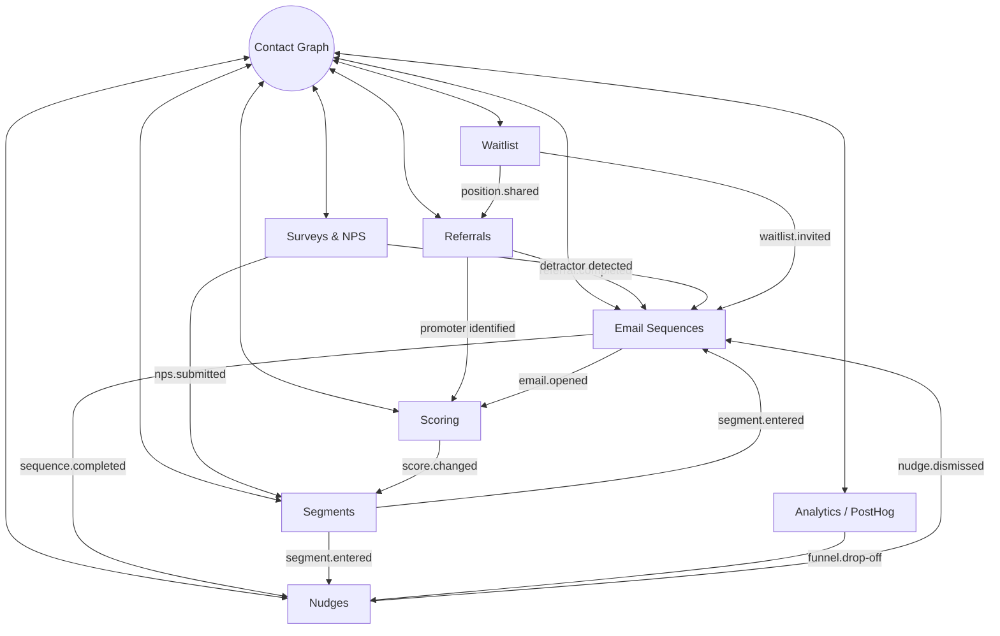
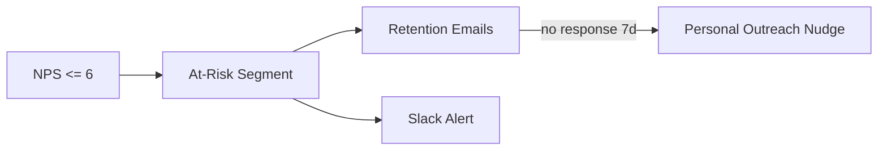
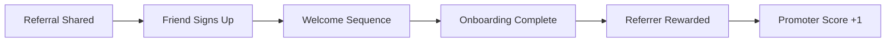
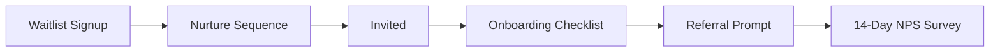
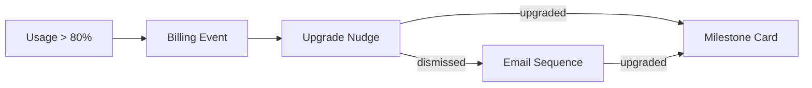

import { Card, CardGrid, LinkCard, Badge, Tabs, TabItem, Steps, Aside } from '@astrojs/starlight/components';

## The Core Thesis

GrowthOS modules share **one contact graph**, **one event bus**, and **one campaign engine**. This is not a convenience — it is the product. Every module that joins the platform makes every other module more powerful, creating compound value that no collection of point solutions can replicate.

A referral program that knows your NPS scores. A waitlist that feeds your email sequences. Surveys that trigger retention workflows. These are not integrations — they are the natural behavior of a unified system.

---

## Data Flow Architecture

Every module reads from and writes to the shared contact graph and event bus. The diagram below shows how data flows between modules in a running GrowthOS instance.

<Aside type="tip">
Every arrow in this diagram is a zero-configuration data flow. There are no Zapier zaps, no webhook chains, no CSV exports. The contact graph is the glue.
</Aside>

---

## Cross-Module Workflow Examples

These are not theoretical. Each workflow runs on the shared event bus with no custom integration code.

### 1. NPS Detractor Recovery

A negative NPS response triggers an automated retention workflow that escalates until the issue is resolved.

<Steps>
1. **Survey detects NPS of 6 or below** — contact is flagged as a detractor
2. **Auto-add to "at-risk" segment** — segment rules trigger immediately on the event
3. **Trigger retention email sequence** — empathetic outreach with help resources
4. **Escalate to Slack** — customer success team gets an alert with full context
5. **If no recovery in 7 days** — personal outreach nudge surfaces in the dashboard
</Steps>

### 2. Referral Full Lifecycle

A single referral triggers a chain of events that touches five modules — all automatically.

<Steps>
1. **User shares referral link** — referral module tracks the share event
2. **Friend signs up** — new contact created in the contact graph
3. **Friend enters welcome sequence** — email module triggers onboarding emails
4. **Friend completes onboarding** — milestone event fires
5. **Referrer receives reward** — referral module processes the reward
6. **Referrer promoter score increases** — scoring module updates the profile
</Steps>

### 3. Waitlist to Activation

Waitlist signups flow seamlessly into the full activation funnel without any manual handoff.

<Steps>
1. **Waitlist signup** — contact auto-created in the contact graph
2. **Enters nurture sequence** — drip emails with product previews and social proof
3. **Invited off waitlist** — invitation event triggers access provisioning
4. **Onboarding checklist** — in-app nudges guide first-time setup
5. **Referral prompt** — after activation, prompt to refer friends
6. **Survey after 14 days** — NPS survey to gauge early satisfaction
</Steps>

### 4. Upgrade Orchestration

Usage-based triggers combine with billing events to drive upgrade conversions through multiple channels.

<Steps>
1. **Usage exceeds 80% of plan limit** — threshold event from the application
2. **Stripe billing event ingested** — GrowthOS captures the billing context
3. **Upgrade prompt nudge** — in-app nudge with usage data and upgrade CTA
4. **If dismissed** — follow-up email sequence with plan comparison
5. **If upgrade completes** — milestone celebration card in-app
</Steps>

---

## Why Point Solutions Cannot Compete

Each workflow above touches 3-5 modules. To replicate any single workflow with point solutions, a team would need to:

| Workflow | Tools Required | Integrations to Build |
|---|---|---|
| NPS Detractor Recovery | Survey tool + email tool + Slack + CRM + custom logic | 4-5 Zapier zaps or custom webhooks |
| Referral Full Lifecycle | Referral tool + email tool + CRM + reward system + scoring | 5+ integrations, most manual |
| Waitlist to Activation | Waitlist tool + email tool + CRM + in-app messaging + survey tool | 5+ integrations with data mapping |
| Upgrade Orchestration | Billing tool + in-app messaging + email tool + CRM | 3-4 integrations with event routing |

In GrowthOS, these workflows require **zero wiring**. They emerge naturally from the shared contact graph and event bus.

<Aside type="caution">
The integration tax is not just the initial build — it is the ongoing maintenance. Every time one vendor changes their API, webhook format, or pricing, the entire chain breaks. GrowthOS eliminates this surface area entirely.
</Aside>

---

## Switching Cost is Organic

GrowthOS does not create lock-in through proprietary data formats or contractual traps. The switching cost is **genuine compound value** that deepens with each module a team adopts.

- **One module** — GrowthOS is a good tool, comparable to a point solution
- **Two modules** — cross-module workflows start delivering value no point solution offers
- **Three+ modules** — the contact graph becomes deeply enriched, segments become precise, and automated workflows compound on each other

This is not lock-in. This is a product that gets better the more you use it.

<CardGrid>
  <LinkCard
    title="Platform Architecture"
    description="See the event bus, tech stack, and infrastructure that powers these data flows."
    href="/growthos/platform/architecture/"
  />
  <LinkCard
    title="Developer Experience"
    description="One SDK, embeddable Web Components, REST APIs — integrate in under 30 minutes."
    href="/growthos/platform/developer-experience/"
  />
</CardGrid>
