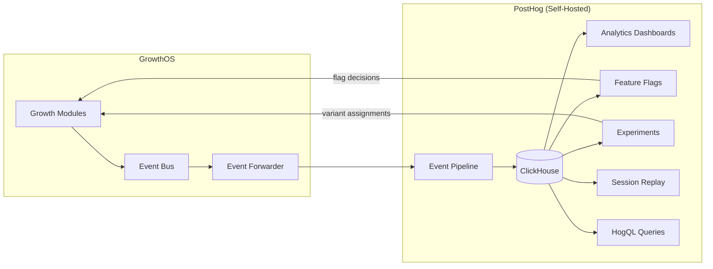
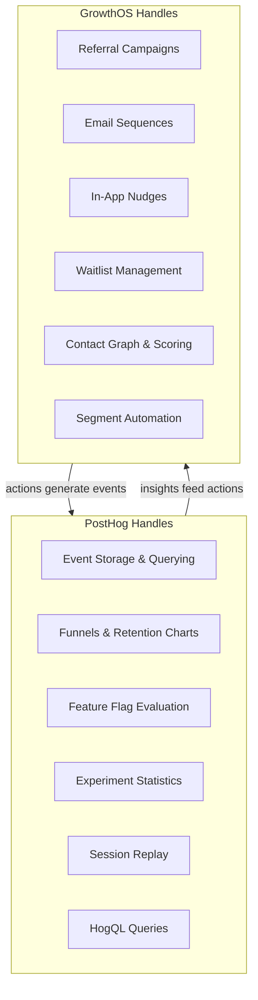

import { Card, CardGrid, LinkCard, Badge, Tabs, TabItem, Steps, Aside } from '@astrojs/starlight/components';

## Why PostHog

GrowthOS does not build its own analytics engine. Instead, it integrates deeply with **PostHog** — the open-source product analytics platform — as its analytics backbone.

The reasoning is straightforward:

- **MIT-licensed FOSS edition** — self-host with no licensing cost
- **Proven at scale** — handles ~100K events/month on a modest self-hosted deployment before requiring infrastructure investment
- **All-in-one analytics** — event tracking, funnels, retention, feature flags, experiments, session replay, surveys, and HogQL in a single platform
- **ClickHouse-powered** — column-oriented storage designed for high-volume event queries
- **Active development** — large open-source community with frequent releases

<Aside type="note">
PostHog tells you **what happened**. GrowthOS does **something about it**. This clean separation is the foundation of the integration.
</Aside>

---

## Integration Architecture

GrowthOS events flow through the event bus into PostHog, where they are stored in ClickHouse and made available for analysis, feature flag evaluation, and experiment tracking. Feature flag decisions flow back into GrowthOS modules to control behavior.

---

## What PostHog Provides

<CardGrid>
  <Card title="Event Analytics" icon="graph">
    Event tracking, funnels, retention charts, and user paths. Understand how contacts move through your growth loops with full event history.
  </Card>
  <Card title="Feature Flags" icon="setting">
    Gradual rollouts and A/B test allocation. Control which contacts see new features, referral campaigns, or UI variants — evaluated server-side or client-side.
  </Card>
  <Card title="Experiments" icon="random">
    Statistical significance testing and variant analysis. Run experiments on referral reward amounts, email subject lines, waitlist mechanics, and more.
  </Card>
  <Card title="Session Replay" icon="laptop">
    Watch real user sessions to debug experience issues. Understand why a referral flow has drop-off or why a survey has low completion rates.
  </Card>
  <Card title="Surveys (Basic)" icon="star">
    PostHog includes basic survey capabilities. GrowthOS extends these with automated follow-up actions, segment routing, and cross-module triggers.
  </Card>
  <Card title="HogQL" icon="document">
    SQL-like query language over the full event stream. Build custom reports, export data for analysis, and power dashboards with ad-hoc queries.
  </Card>
</CardGrid>

---

## What GrowthOS Adds on Top

PostHog is the **observation layer**. GrowthOS is the **action layer**. Together, they close the loop from insight to outcome.

| PostHog Observes | GrowthOS Acts |
|---|---|
| Funnel drop-off at step 3 | Trigger a re-engagement nudge for contacts who dropped off |
| NPS score distribution | Auto-route detractors to retention sequences, promoters to referral prompts |
| Feature adoption rate | Gate referral rewards behind feature activation milestones |
| Experiment variant wins | Roll out the winning variant to all contacts via feature flags |
| Session replay shows confusion | Trigger a contextual micro-survey at the point of friction |
| Retention curve flattens at day 7 | Launch a day-7 email sequence with activation tips |

<Aside type="tip">
This is the interoperability advantage in action. PostHog provides world-class analytics, and GrowthOS provides the growth automation layer that turns those analytics into revenue. Neither needs to do the other's job.
</Aside>

### Modules PostHog Cannot Replace

PostHog does not include — and is not designed to include — these GrowthOS capabilities:

- **Referral programs** — two-sided campaigns with reward tracking, fraud detection, and viral mechanics
- **Lifecycle email sequences** — event-driven multi-step email workflows
- **In-app nudges** — contextual prompts tied to segments and user behavior
- **Viral waitlists** — priority-ranked queues with share-to-move-up mechanics
- **Advocacy programs** — milestone-based programs that turn users into champions
- **Unified contact graph** — single identity across all modules and touchpoints

---

## Scaling Considerations

The PostHog integration is designed to scale with GrowthOS from early-stage to growth-stage.

<Tabs>
  <TabItem label="Stage 1: Launch">
    - **PostHog FOSS** self-hosted on a single server
    - Handles analytics and feature flags for up to ~100K events/month
    - GrowthOS event forwarder sends events via PostHog's capture API
    - Total infrastructure cost: minimal (runs alongside GrowthOS services)
  </TabItem>
  <TabItem label="Stage 2: Growth">
    - Scale ClickHouse horizontally as event volume increases
    - Add PostHog replicas for dashboard query performance
    - Build custom event forwarding layer with batching and retry logic
    - Consider PostHog Cloud for managed infrastructure if ops burden grows
  </TabItem>
  <TabItem label="Stage 3: Scale">
    - Dedicated ClickHouse cluster for high-volume analytics
    - PostHog Cloud or self-managed cluster with sharding
    - Event bus handles millions of events/day with RedPanda scaling
    - GrowthOS modules remain unchanged — the forwarding layer absorbs scale
  </TabItem>
</Tabs>

---

## Build vs Buy Clarity

The boundary between PostHog and GrowthOS is clean and deliberate.

PostHog and GrowthOS form a **virtuous cycle**: modules generate events, PostHog analyzes them, insights trigger module actions, and those actions generate more events. Neither component tries to do the other's job.

<CardGrid>
  <LinkCard
    title="Platform Architecture"
    description="See the full tech stack, event schema, and infrastructure decisions."
    href="/growthos/platform/architecture/"
  />
  <LinkCard
    title="The Interoperability Advantage"
    description="How shared identity and cross-module data flows create compound value."
    href="/growthos/platform/interoperability/"
  />
</CardGrid>
