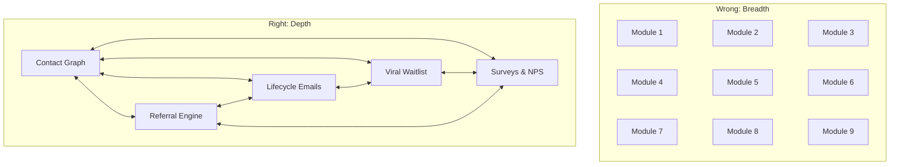

import { Card, CardGrid, LinkCard, Badge, Tabs, TabItem, Steps, Aside } from '@astrojs/starlight/components';

Building the right things is half the battle. The other half is **not building the wrong things**. These anti-patterns represent the traps that growth platforms fall into — and the principles that keep GrowthOS focused.

---

## 1. "Build Everything"

**The trap:** Every customer request becomes a feature. The platform grows into a Swiss army knife where nothing works well and everything is half-finished.

**Our principle:** Each module must connect to the Contact Graph and Event Bus meaningfully. If a feature cannot enrich a contact record or trigger/respond to events, it does not belong in GrowthOS.

<Aside type="caution" title="The Test">
Before building any feature, ask: "Does this read from or write to the Contact Graph?" If the answer is no, it probably belongs in a different product.
</Aside>

---

## 2. "Compete with Best-in-Class"

**The trap:** Rebuilding PostHog analytics, Stripe billing, Discourse communities, or Appcues product tours inside GrowthOS. Spending months to build a 60% version of a tool that already exists at 100%.

**Our principle:** Don't rebuild PostHog analytics. Don't rebuild Stripe billing. Don't rebuild Discourse communities. **Integrate, don't duplicate.** The [Webhook Engine (P2-12)](/growthos/phase-2/webhook-engine/) exists specifically so that best-in-class tools can participate in GrowthOS workflows without being rebuilt inside GrowthOS.

This is why 13 features are on the [kill list](/growthos/killed/discounted-ideas/) — each one had a best-in-class alternative that a webhook could connect to.

---

## 3. "Enterprise First"

**The trap:** Chasing enterprise deals before the product-market fit is proven. Building SSO, audit logs, SCIM provisioning, and custom SLAs when you have 20 customers.

**Our principle:** Serve indie and small SaaS teams first. Enterprise features dilute focus and slow shipping speed. Phase 1 targets 30 customers at $29–$59/mo, not 3 customers at $5,000/mo. Enterprise features arrive in Phase 3–4, earned by demand — not built on speculation.

<Aside type="note" title="Enterprise Follows PLG">
The path to enterprise is through product-led growth, not through enterprise sales. When an enterprise team's individual members already use GrowthOS, the enterprise deal closes itself. Build for individuals first.
</Aside>

---

## 4. "Feature Gates as Growth"

**The trap:** Building growth modules that insert into the authentication/authorization layer — controlling which features a user can access based on their plan, managing trial-to-paid transitions, gating API access.

**Our principle:** Growth modules that touch auth/authz are dangerous. A bug in feature gating locks users out of their own product. Let Stripe handle plan-based entitlements. Let PostHog handle feature flags. GrowthOS sits **beside** the product, not **inside** the access control layer.

This is specifically why [K-37 (Paywalled Feature Gates)](/growthos/killed/discounted-ideas/) was killed despite scoring 10/20.

---

## 5. "Single-Use Tools"

**The trap:** Building features that provide one-time campaign value — a contest runner, a QR code generator, a giveaway engine. Run once, get a spike, never use again.

**Our principle:** Every module must provide **recurring, compounding value**, not one-time campaign value. Referral links generate new contacts every day. Email sequences nurture contacts continuously. Surveys collect feedback on an ongoing basis.

The [Viral Waitlist](/growthos/phase-1/viral-waitlist/) is the closest exception — but even it feeds contacts into the lifecycle pipeline permanently. A contest engine generates excitement for 2 weeks and then sits idle.

---

## 6. "Lock-In over Value"

**The trap:** Making it hard to leave instead of making it compelling to stay. Proprietary data formats. Export restrictions. No API access. Deliberate incompatibility with competitors.

**Our principle:** Switching cost should be **organic** — rich cross-module data, compounding contact history, workflows that took months to build and refine. Not **artificial** — proprietary formats, data export restrictions, API paywalls.

GrowthOS provides full data export, open API access, and webhook connectivity. Tenants stay because the integrated stack is more valuable than the sum of its parts — not because we hold their data hostage.

---

## 7. "Breadth over Depth"

**The trap:** Shipping 15 shallow modules in Phase 1 instead of 5 deep ones. Launching with a feature grid that looks impressive in a comparison table but falls apart under real usage.

**Our principle:** Phase 1 ships 5 modules, not 15. Depth of integration between 5 modules beats shallow implementation of 15. Each module must be **production-grade and fully integrated** before Phase 2 begins.

Nine disconnected modules (left) lose to five deeply integrated modules (right) every time.

---

## 8. "Webhook is Always Enough"

**The trap:** Over-relying on webhooks. Using "just webhook it" as an excuse to never build anything natively. Ending up as a thin orchestration layer with no own capabilities.

**Our principle:** Know when to build and when to webhook.

| Build When... | Webhook When... |
|---------------|-----------------|
| The feature needs deep Contact Graph integration | The tool is best-in-class and the growth logic sits in GrowthOS |
| Real-time, in-app interaction is required | The feature is tangential to the growth mission |
| The data must flow bidirectionally with other modules | A mature, affordable tool already solves 90% of the problem |
| The module creates compounding value over time | The feature is one-time or episodic |

**Examples:**

- **Build:** Referral Engine — needs per-contact links, fraud detection, reward tracking, deep Contact Graph integration.
- **Webhook:** Community events — Discourse is best-in-class; a webhook sends community activity into the Contact Graph.
- **Build:** Email Sequences — core channel, must be deeply integrated with segments, events, and contact data.
- **Webhook:** Webinar attendance — Luma handles the event; a webhook captures attendance data.

---

## Risk Analysis

| Risk | Severity | Mitigation |
|------|:--------:|-----------|
| Breadth trap — too many modules, none deep enough | High | Phase 1: only 5 modules. Expand based on demand, not ambition. |
| PostHog FOSS limitations — self-hosted PostHog may not scale | Medium | Start FOSS, build custom event forwarding, scale to ClickHouse as needed. |
| Multi-tenant data leakage — tenant A sees tenant B's data | High | Row-level security on every query. Automated tests for data isolation. Security audit before launch. |
| Component performance — embeddable widgets slow down tenant's app | Medium | < 50KB gzipped per component. Shadow DOM isolation. CDN delivery. Lazy-loaded. CI performance budget enforced on every PR. |
| Market education — "growth platform" is a new category, not a search term | Medium | Land with one recognizable module (referrals or email), expand within the tenant. PLG for a growth tool — eat your own cooking. |
| Competitive response — established players copy features | Medium | Moat is the **unified Contact Graph + embeddable components**. Speed and early adoption matter more than feature parity. |

---

## The Decision Framework

When evaluating any new feature request, run it through these filters in order:

<Steps>
1. **Does it connect to the Contact Graph?** If no, it probably does not belong in GrowthOS.
2. **Does a best-in-class tool already exist?** If yes, can a webhook integration serve 80%+ of the use case?
3. **Is the value recurring or one-time?** One-time value features get killed.
4. **Does it require auth/authz integration?** If yes, it is almost certainly too risky.
5. **Can we ship a production-grade version in ≤ 4 weeks?** If no, consider whether the scope is right for the current phase.
6. **Does it strengthen the moat?** Features that deepen the Contact Graph, increase cross-module integration, or create data network effects get priority.
</Steps>

Features that pass all six filters earn a place on the [Master Scorecard](/growthos/roadmap/master-scorecard/). Features that fail get added to the [kill list](/growthos/killed/discounted-ideas/).
