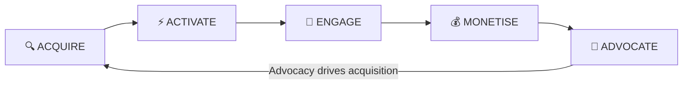
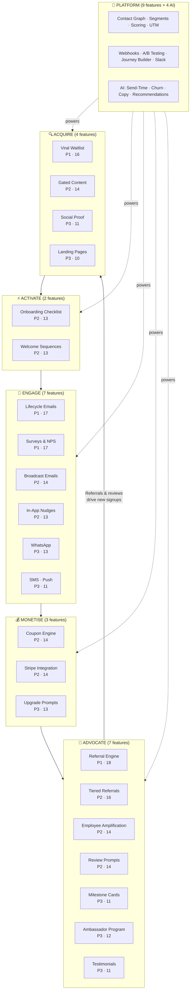

import { Card, CardGrid, LinkCard, Badge, Tabs, TabItem, Steps, Aside } from '@astrojs/starlight/components';

Every SaaS growth motion follows the same fundamental loop. GrowthOS maps **every feature** to a stage in this loop — so there are no orphan modules and no gaps in the flywheel.

<Aside type="tip" title="Why this matters">
Point solutions serve one stage. GrowthOS serves all five — and because every module shares one contact graph and one event bus, the **transitions between stages are automatic**. An NPS promoter (Engage) becomes a referral source (Advocate) who drives a signup (Acquire) who enters onboarding (Activate) — with zero custom wiring.
</Aside>

---

## Acquire — Fill the top of the funnel

Capture leads, generate awareness, and bring prospects into your world.

### Shortlisted Features

| # | Feature | Score | Phase | Classification |
|---|---------|:-----:|:-----:|----------------|
| P1-04 | [Viral Waitlist](/growthos/phase-1/viral-waitlist/) | 16/20 | Phase 1 | <Badge text="Painkiller" variant="tip" /> |
| P2-07 | [Gated Content / Lead Capture](/growthos/phase-2/gated-content/) | 14/20 | Phase 2 | <Badge text="Painkiller" variant="tip" /> |
| P3-19 | [Social Proof Widget](/growthos/phase-3/social-proof-widget/) | 11/20 | Phase 3 | <Badge text="Vitamin" variant="caution" /> |
| P3-29 | [Landing Page Builder](/growthos/phase-3/landing-page-builder/) | 10/20 | Phase 3 | <Badge text="Vitamin" variant="caution" /> |

<CardGrid>
  <LinkCard title="Viral Waitlist" description="Share-to-move-up mechanics turn your launch queue into a growth loop. Auto-creates contacts, feeds email sequences." href="/growthos/phase-1/viral-waitlist/" />
  <LinkCard title="Gated Content" description="Gate content behind email capture. Contacts auto-created, nurture sequences auto-triggered." href="/growthos/phase-2/gated-content/" />
  <LinkCard title="Social Proof Widget" description="Real-time signup/purchase notifications. Proven 10–15% conversion lift." href="/growthos/phase-3/social-proof-widget/" />
  <LinkCard title="Landing Page Builder" description="Template-based pages with native GrowthOS components auto-connected to the contact graph." href="/growthos/phase-3/landing-page-builder/" />
</CardGrid>

### Killed Acquire Features

| # | Feature | Score | Why Killed |
|---|---------|:-----:|-----------|
| K-40 | Contact Sync & Discovery | 9/20 | B2B SaaS doesn't need contact book sync. GDPR/DPDPA compliance too complex. |
| K-44 | Event / Webinar Engine | 8/20 | Luma, Zoom, Eventbrite own this. Webhook integration instead. |
| K-45 | Missed-Call-to-WhatsApp | 10/20 | India-specific (Exotel + Gupshup). Webhook enables it for those who need it. |
| K-46 | QR Code Engine | 9/20 | QR codes are free (goqr.me). Zero moat, zero pain. |
| K-47 | Link-in-Bio Page | 8/20 | Linktree ($5/mo), 40M+ users. No pain, no moat, no revenue. |
| K-48 | Contest / Giveaway Engine | 8/20 | KickoffLabs, Gleam do this. Ephemeral campaigns, not recurring infrastructure. |

---

## Activate — Turn signups into engaged users

Guide new users to their "aha moment" as fast as possible.

### Shortlisted Features

| # | Feature | Score | Phase | Classification |
|---|---------|:-----:|:-----:|----------------|
| P2-08 | [Onboarding Checklist](/growthos/phase-2/onboarding-checklist/) | 13/20 | Phase 2 | <Badge text="Vitamin" variant="caution" /> |
| P2-17 | [Welcome Sequences (Branching)](/growthos/phase-2/welcome-sequences/) | 13/20 | Phase 2 | <Badge text="Vitamin" variant="caution" /> |

<CardGrid>
  <LinkCard title="Onboarding Checklist" description="In-app checklist widget. Progress tracked per contact. Incomplete steps trigger nudge emails." href="/growthos/phase-2/onboarding-checklist/" />
  <LinkCard title="Welcome Sequences" description="Branching welcome emails by persona, plan, and behavior. Developers get path A, marketers get path B." href="/growthos/phase-2/welcome-sequences/" />
</CardGrid>

### Killed Activate Features

| # | Feature | Score | Why Killed |
|---|---------|:-----:|-----------|
| K-41 | Interactive Product Tours | 8/20 | Appcues territory ($249/mo). 8+ weeks for a mediocre version. In-App Nudges covers 80% at 20% effort. |
| K-49 | Magic Link / Passwordless Auth | 8/20 | Auth is the tenant's responsibility. Clerk, Auth0, Firebase own this. GrowthOS is growth, not identity. |

---

## Engage — Keep users active and coming back

Drive habitual usage through timely, contextual communication across every channel.

### Shortlisted Features

| # | Feature | Score | Phase | Classification |
|---|---------|:-----:|:-----:|----------------|
| P1-03 | [Lifecycle Emails](/growthos/phase-1/lifecycle-emails/) | 17/20 | Phase 1 | <Badge text="Painkiller" variant="tip" /> |
| P1-05 | [Surveys & NPS](/growthos/phase-1/surveys-nps/) | 17/20 | Phase 1 | <Badge text="Painkiller" variant="tip" /> |
| P2-10 | [Broadcast Emails](/growthos/phase-2/broadcast-emails/) | 14/20 | Phase 2 | <Badge text="Painkiller" variant="tip" /> |
| P2-14 | [In-App Nudges](/growthos/phase-2/in-app-nudges/) | 13/20 | Phase 2 | <Badge text="Vitamin" variant="caution" /> |
| P3-23 | [WhatsApp](/growthos/phase-3/whatsapp/) | 13/20 | Phase 3 | <Badge text="Painkiller" variant="tip" /> |
| P3-24 | [SMS](/growthos/phase-3/sms/) | 11/20 | Phase 3 | <Badge text="Vitamin" variant="caution" /> |
| P3-25 | [Push Notifications](/growthos/phase-3/push-notifications/) | 11/20 | Phase 3 | <Badge text="Vitamin" variant="caution" /> |

<CardGrid>
  <LinkCard title="Lifecycle Emails" description="Event-triggered multi-step sequences. 320% more revenue than manual campaigns. Replaces Customer.io." href="/growthos/phase-1/lifecycle-emails/" />
  <LinkCard title="Surveys & NPS" description="Micro-surveys with auto-actions. Detractors get retention emails. Promoters get referral invites." href="/growthos/phase-1/surveys-nps/" />
  <LinkCard title="Broadcast Emails" description="One-time newsletters and announcements to segments. Same infra, same contact graph." href="/growthos/phase-2/broadcast-emails/" />
  <LinkCard title="In-App Nudges" description="Targeted banners, modals, tooltips — segment-targeted, event-triggered, no code changes." href="/growthos/phase-2/in-app-nudges/" />
  <LinkCard title="WhatsApp" description="90%+ open rates in India/emerging markets. Integrated into journey builder and sequences." href="/growthos/phase-3/whatsapp/" />
  <LinkCard title="SMS" description="Time-sensitive growth messages via Twilio/MessageBird. Journey builder integrated." href="/growthos/phase-3/sms/" />
</CardGrid>

### Killed Engage Features

| # | Feature | Score | Why Killed |
|---|---------|:-----:|-----------|
| K-39 | Community Hub (Self-Hosted) | 6/20 | Discourse is free, mature (200K+ deployments). We'd build a worse version. Webhook instead. |
| K-42 | Changelog / What's New | 9/20 | LaunchNotes, Beamer handle this. Changelog is content, not a growth engine. |
| K-43 | Gamification (Streaks, Badges) | 8/20 | Vitamin for consumer apps at 10M+ users. Distraction for SaaS with 500–5K users. |

---

## Monetise — Convert value into revenue

Capture revenue at the right moment with intelligent, data-driven prompts.

### Shortlisted Features

| # | Feature | Score | Phase | Classification |
|---|---------|:-----:|:-----:|----------------|
| P2-11 | [Coupon Engine](/growthos/phase-2/coupon-engine/) | 14/20 | Phase 2 | <Badge text="Painkiller" variant="tip" /> |
| P2-31 | [Stripe Integration](/growthos/phase-2/stripe-integration/) | 14/20 | Phase 2 | <Badge text="Painkiller" variant="tip" /> |
| P3-30 | [Upgrade Prompts](/growthos/phase-3/upgrade-prompts/) | 13/20 | Phase 3 | <Badge text="Painkiller" variant="tip" /> |

<CardGrid>
  <LinkCard title="Coupon Engine" description="Generate, distribute, track discount codes tied to segments. Know which coupons drive real conversions." href="/growthos/phase-2/coupon-engine/" />
  <LinkCard title="Stripe Integration" description="Billing events flow into the contact graph. Trial expiry, failed payment, upgrade — all trigger campaigns." href="/growthos/phase-2/stripe-integration/" />
  <LinkCard title="Upgrade Prompts" description="Contextual upgrade nudges when users hit plan limits or show expansion signals." href="/growthos/phase-3/upgrade-prompts/" />
</CardGrid>

### Killed Monetise Features

| # | Feature | Score | Why Killed |
|---|---------|:-----:|-----------|
| K-37 | Paywalled Feature Gates | 10/20 | Better handled by Stripe + PostHog. Too high-risk inserting GrowthOS into billing/access control. |
| K-38 | Pricing Page Experiments | 7/20 | PostHog's experiments already superior. Zero reason to rebuild. |

---

## Advocate — Turn happy users into your growth engine

Mobilize promoters to drive the next wave of acquisition — **closing the loop**.

### Shortlisted Features

| # | Feature | Score | Phase | Classification |
|---|---------|:-----:|:-----:|----------------|
| P1-02 | [Referral Engine](/growthos/phase-1/referral-engine/) | 18/20 | Phase 1 | <Badge text="Painkiller" variant="tip" /> |
| P2-13 | [Employee Amplification](/growthos/phase-2/employee-amplification/) | 14/20 | Phase 2 | <Badge text="Painkiller" variant="tip" /> |
| P2-15 | [Review Prompts](/growthos/phase-2/review-prompts/) | 14/20 | Phase 2 | <Badge text="Painkiller" variant="tip" /> |
| P2-16 | [Tiered Referrals](/growthos/phase-2/tiered-referrals/) | 16/20 | Phase 2 | <Badge text="Painkiller" variant="tip" /> |
| P3-26 | [Milestone Cards](/growthos/phase-3/milestone-cards/) | 11/20 | Phase 3 | <Badge text="Vitamin" variant="caution" /> |
| P3-27 | [Ambassador Program](/growthos/phase-3/ambassador-program/) | 12/20 | Phase 3 | <Badge text="Vitamin" variant="caution" /> |
| P3-28 | [Testimonial Collector](/growthos/phase-3/testimonial-collector/) | 11/20 | Phase 3 | <Badge text="Vitamin" variant="caution" /> |

<CardGrid>
  <LinkCard title="Referral Engine" description="Highest-scoring feature (18/20). Per-user links, configurable rewards, embeddable widget, fraud detection." href="/growthos/phase-1/referral-engine/" />
  <LinkCard title="Tiered Referrals" description="Graduated reward tiers. More referrals = better rewards. Automated Stripe payouts, leaderboard." href="/growthos/phase-2/tiered-referrals/" />
  <LinkCard title="Employee Amplification" description="Pre-approved social content for your team. UTM-tracked per employee. Know which shares drive signups." href="/growthos/phase-2/employee-amplification/" />
  <LinkCard title="Review Prompts" description="NPS-gated review requests for G2, Capterra, Product Hunt. Only ask happy users." href="/growthos/phase-2/review-prompts/" />
  <LinkCard title="Milestone Cards" description="Spotify Wrapped-style shareable cards. Users share on social = free organic reach." href="/growthos/phase-3/milestone-cards/" />
  <LinkCard title="Ambassador Program" description="Auto-identify top advocates. Invite to formal program with exclusive perks and tracking." href="/growthos/phase-3/ambassador-program/" />
</CardGrid>

<Aside type="note" title="The loop closes here">
Every Advocate feature feeds directly back into Acquire. A referral creates a new contact (Acquire) who enters onboarding (Activate). An employee share drives a signup (Acquire). A review on G2 generates inbound traffic (Acquire). The flywheel spins faster with each cycle.
</Aside>

---

## Platform Layer — Powers every stage

These features are not stage-specific — they provide the **shared infrastructure** that makes the loop work.

### Foundation & Platform

| # | Feature | Score | Phase | Role |
|---|---------|:-----:|:-----:|------|
| P1-01 | [Unified Contact Graph](/growthos/phase-1/unified-contact-graph/) | 16/20 | Phase 1 | Single identity across all stages |
| P2-06 | [Segment Builder](/growthos/phase-2/segment-builder/) | 14/20 | Phase 2 | Target any stage by audience rules |
| P2-09 | [UTM Attribution](/growthos/phase-2/utm-attribution/) | 14/20 | Phase 2 | Measure which Acquire channels work |
| P2-12 | [Webhook Engine](/growthos/phase-2/webhook-engine/) | 13/20 | Phase 2 | Connect external tools to any stage |
| P2-18 | [Contact Scoring](/growthos/phase-2/contact-scoring/) | 13/20 | Phase 2 | Prioritize contacts across all stages |
| P3-20 | [Cohort Analytics](/growthos/phase-3/cohort-analytics/) | 12/20 | Phase 3 | Measure retention across the loop |
| P3-21 | [A/B Testing](/growthos/phase-3/ab-testing/) | 12/20 | Phase 3 | Optimize any module at any stage |
| P3-22 | [Journey Builder](/growthos/phase-3/journey-builder/) | 13/20 | Phase 3 | Orchestrate cross-stage flows visually |
| P3-32 | [Slack Integration](/growthos/phase-3/slack-integration/) | 12/20 | Phase 3 | Real-time alerts for any stage event |

### AI Layer (Phase 4)

| # | Feature | Score | Phase | Role |
|---|---------|:-----:|:-----:|------|
| P4-33 | [Send-Time Optimization](/growthos/phase-4/send-time-optimization/) | 11/20 | Phase 4 | Optimize Engage timing per contact |
| P4-34 | [Churn Prediction](/growthos/phase-4/churn-prediction/) | 10/20 | Phase 4 | Predict and prevent Engage drop-off |
| P4-35 | [Auto-Generated Copy](/growthos/phase-4/auto-copy/) | 9/20 | Phase 4 | Generate copy for any stage |
| P4-36 | [Module Recommendations](/growthos/phase-4/module-recommendations/) | 8/20 | Phase 4 | Recommend next-best module to activate |

---

## The Complete Picture

---

## Summary by Stage

| Stage | Features | Top Score | Key Metric |
|-------|:--------:|:---------:|-----------|
| **Acquire** | 4 built, 6 killed | 16/20 | Signups per week |
| **Activate** | 2 built, 2 killed | 13/20 | Time to aha moment |
| **Engage** | 7 built, 3 killed | 17/20 | DAU/MAU ratio |
| **Monetise** | 3 built, 2 killed | 14/20 | Conversion rate |
| **Advocate** | 7 built, 0 killed | 18/20 | Viral coefficient |
| **Platform** | 13 built | 16/20 | Modules per tenant |
| **Total** | **36 built, 13 killed** | **18/20** | |

<Aside type="tip" title="The discipline of killing">
We killed 13 features — and that's the point. Every killed feature either (a) has an excellent existing solution, (b) doesn't connect meaningfully to the contact graph, (c) is ephemeral rather than recurring infrastructure, or (d) is better served by a webhook integration. See the full list with rationale: **[Discounted Ideas](/growthos/killed/discounted-ideas/)**
</Aside>

---

## Explore by Phase

<CardGrid>
  <LinkCard title="Phase 1 — MLP" description="5 features, months 1–4. Replace 5 tools, land first 30 customers." href="/growthos/phase-1/overview/" />
  <LinkCard title="Phase 2 — Platform Maturity" description="14 features, months 5–9. Mid-market expansion, $20K–$50K MRR." href="/growthos/phase-2/overview/" />
  <LinkCard title="Phase 3 — Scale" description="13 features, months 10–15. Journey builder, multi-channel, $80K–$200K MRR." href="/growthos/phase-3/overview/" />
  <LinkCard title="Phase 4 — AI Layer" description="4 features, months 16–20. Predictive intelligence, enterprise pricing." href="/growthos/phase-4/overview/" />
</CardGrid>
