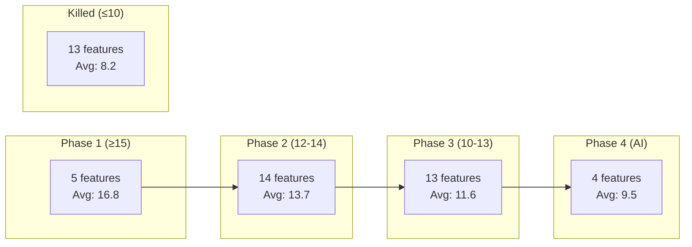

import { Card, CardGrid, LinkCard, Badge, Tabs, TabItem, Steps, Aside } from '@astrojs/starlight/components';

Every feature in GrowthOS is scored on four dimensions before it earns a place on the roadmap. This is the complete, unedited scorecard — 36 features we build and 13 we killed.

---

## Scoring Framework

| Dimension | Scale | Definition |
|-----------|:-----:|-----------|
| **Pain Severity** | 1–5 | How much does the absence hurt indie/small SaaS teams? (5 = losing money) |
| **Revenue Proximity** | 1–5 | Direct willingness to pay? (5 = clearly monetizable) |
| **Build Complexity** | 1–5 | Engineering effort — inverted: 5 = easy/fast, 1 = months of work |
| **Moat / Defensibility** | 1–5 | Can a competitor clone it quickly? (5 = network effects / data moat) |

**Maximum score: 20/20.**

---

## Phase Assignment Thresholds

| Score Range | Assignment |
|:-----------:|-----------|
| **≥ 15/20** | Phase 1 — Minimum Lovable Product |
| **12–14/20** | Phase 2 — Growth Engine |
| **10–11/20** | Phase 3 — Scale & Sophistication |
| **≤ 9/20** | Kill / Park |

<Aside type="tip" title="Phase 4 is Different">
Phase 4 (AI Layer) features score 8–11/20 but are not killed because they serve a strategic purpose: justifying enterprise pricing and building a data moat. They are **Vitamins by design** — enhancements on top of a working stack, not standalone painkillers.
</Aside>

---

## Phase 1 — Minimum Lovable Product

*Months 1–4 | Score threshold: ≥ 15/20*

| # | Feature | Pain | Revenue | Build | Moat | Total |
|---|---------|:----:|:-------:|:-----:|:----:|:-----:|
| P1-01 | [Unified Contact Graph](/growthos/phase-1/unified-contact-graph/) | 4 | 3 | 4 | 5 | **16** |
| P1-02 | [Referral Engine](/growthos/phase-1/referral-engine/) | 5 | 5 | 4 | 4 | **18** |
| P1-03 | [Lifecycle Emails](/growthos/phase-1/lifecycle-emails/) | 5 | 4 | 4 | 4 | **17** |
| P1-04 | [Viral Waitlist](/growthos/phase-1/viral-waitlist/) | 4 | 4 | 4 | 4 | **16** |
| P1-05 | [Surveys & NPS](/growthos/phase-1/surveys-nps/) | 5 | 4 | 4 | 4 | **17** |

---

## Phase 2 — Growth Engine

*Months 5–9 | Score threshold: 12–14/20*

| # | Feature | Pain | Revenue | Build | Moat | Total |
|---|---------|:----:|:-------:|:-----:|:----:|:-----:|
| P2-06 | [Segment Builder](/growthos/phase-2/segment-builder/) | 4 | 3 | 4 | 3 | **14** |
| P2-07 | [Gated Content](/growthos/phase-2/gated-content/) | 3 | 4 | 4 | 3 | **14** |
| P2-08 | [Onboarding Checklist](/growthos/phase-2/onboarding-checklist/) | 3 | 3 | 4 | 3 | **13** |
| P2-09 | [UTM Attribution](/growthos/phase-2/utm-attribution/) | 4 | 3 | 4 | 3 | **14** |
| P2-10 | [Broadcast Emails](/growthos/phase-2/broadcast-emails/) | 4 | 4 | 3 | 3 | **14** |
| P2-11 | [Coupon Engine](/growthos/phase-2/coupon-engine/) | 3 | 4 | 4 | 3 | **14** |
| P2-12 | [Webhook Engine](/growthos/phase-2/webhook-engine/) | 3 | 3 | 4 | 3 | **13** |
| P2-13 | [Employee Amplification](/growthos/phase-2/employee-amplification/) | 3 | 4 | 4 | 3 | **14** |
| P2-14 | [In-App Nudges](/growthos/phase-2/in-app-nudges/) | 3 | 3 | 4 | 3 | **13** |
| P2-15 | [Review Prompts](/growthos/phase-2/review-prompts/) | 3 | 4 | 4 | 3 | **14** |
| P2-16 | [Tiered Referrals](/growthos/phase-2/tiered-referrals/) | 4 | 4 | 4 | 4 | **16** |
| P2-17 | [Welcome Sequences](/growthos/phase-2/welcome-sequences/) | 3 | 3 | 4 | 3 | **13** |
| P2-18 | [Contact Scoring](/growthos/phase-2/contact-scoring/) | 3 | 3 | 4 | 3 | **13** |
| P2-31 | [Stripe Integration](/growthos/phase-2/stripe-integration/) | 4 | 4 | 3 | 3 | **14** |

---

## Phase 3 — Scale & Sophistication

*Months 10–15 | Score threshold: 10–11/20*

| # | Feature | Pain | Revenue | Build | Moat | Total |
|---|---------|:----:|:-------:|:-----:|:----:|:-----:|
| P3-19 | [Social Proof Widget](/growthos/phase-3/social-proof-widget/) | 3 | 2 | 4 | 2 | **11** |
| P3-20 | [Cohort Analytics](/growthos/phase-3/cohort-analytics/) | 3 | 3 | 3 | 3 | **12** |
| P3-21 | [A/B Testing](/growthos/phase-3/ab-testing/) | 3 | 3 | 3 | 3 | **12** |
| P3-22 | [Journey Builder](/growthos/phase-3/journey-builder/) | 4 | 4 | 2 | 3 | **13** |
| P3-23 | [WhatsApp](/growthos/phase-3/whatsapp/) | 4 | 4 | 2 | 3 | **13** |
| P3-24 | [SMS](/growthos/phase-3/sms/) | 3 | 3 | 3 | 2 | **11** |
| P3-25 | [Push Notifications](/growthos/phase-3/push-notifications/) | 3 | 3 | 3 | 2 | **11** |
| P3-26 | [Milestone Cards](/growthos/phase-3/milestone-cards/) | 2 | 3 | 4 | 2 | **11** |
| P3-27 | [Ambassador Program](/growthos/phase-3/ambassador-program/) | 3 | 4 | 3 | 2 | **12** |
| P3-28 | [Testimonial Collector](/growthos/phase-3/testimonial-collector/) | 2 | 3 | 4 | 2 | **11** |
| P3-29 | [Landing Pages](/growthos/phase-3/landing-page-builder/) | 2 | 3 | 2 | 3 | **10** |
| P3-30 | [Upgrade Prompts](/growthos/phase-3/upgrade-prompts/) | 4 | 5 | 3 | 3 | **13** |
| P3-32 | [Slack Integration](/growthos/phase-3/slack-integration/) | 3 | 3 | 4 | 2 | **12** |

---

## Phase 4 — AI Layer

*Months 16–20 | Strategic AI features*

| # | Feature | Pain | Revenue | Build | Moat | Total |
|---|---------|:----:|:-------:|:-----:|:----:|:-----:|
| P4-33 | [Send-Time Optimization](/growthos/phase-4/send-time-optimization/) | 3 | 3 | 2 | 3 | **11** |
| P4-34 | [Churn Prediction](/growthos/phase-4/churn-prediction/) | 3 | 3 | 2 | 2 | **10** |
| P4-35 | [Auto-Generated Copy](/growthos/phase-4/auto-copy/) | 2 | 2 | 3 | 2 | **9** |
| P4-36 | [Module Recommendations](/growthos/phase-4/module-recommendations/) | 2 | 2 | 2 | 2 | **8** |

---

## Killed Features

*Score ≤ 10/20 — better served by existing tools or webhook integrations*

| # | Feature | Score | Killed Reason |
|---|---------|:-----:|---------------|
| K-37 | Paywalled Feature Gates | 10 | Stripe + PostHog handle this; too risky in auth layer |
| K-38 | Pricing Page Experiments | 7 | PostHog experiments already superior |
| K-39 | Community Hub | 6 | Discourse is free and mature; webhook instead |
| K-40 | Contact Sync & Discovery | 9 | Privacy/GDPR/DPDPA complexity; wrong audience |
| K-41 | Interactive Product Tours | 8 | Appcues territory; In-App Nudges covers 80% |
| K-42 | Changelog / What's New | 9 | LaunchNotes/Beamer; content, not growth engine |
| K-43 | Gamification | 8 | Consumer pattern, not B2B SaaS |
| K-44 | Event / Webinar Engine | 8 | Luma/Zoom own this; webhook instead |
| K-45 | Missed-Call-to-WhatsApp | 10 | India-specific; webhook enables it |
| K-46 | QR Code Engine | 9 | Commoditized, zero moat |
| K-47 | Link-in-Bio Page | 8 | Linktree ($5/mo); no pain, no moat |
| K-48 | Contest / Giveaway Engine | 8 | Ephemeral, not recurring infrastructure |
| K-49 | Magic Link / Passwordless Auth | 8 | Auth is tenant's job; Clerk/Auth0/Firebase |

For detailed rationale on each killed feature, see [Discounted Ideas](/growthos/killed/discounted-ideas/).

---

## Score Distribution

---

## How to Read This Scorecard

- **High Pain + High Revenue** = Painkiller. Build first. (Phase 1)
- **Medium Pain + Medium Revenue** = Growth Engine. Build when foundation is solid. (Phase 2)
- **Low Pain + High Moat** = Platform play. Build for defensibility. (Phase 3)
- **Low Pain + Data-dependent** = AI Layer. Build when data exists. (Phase 4)
- **Low everything** = Kill. Integrate via webhook if needed.
