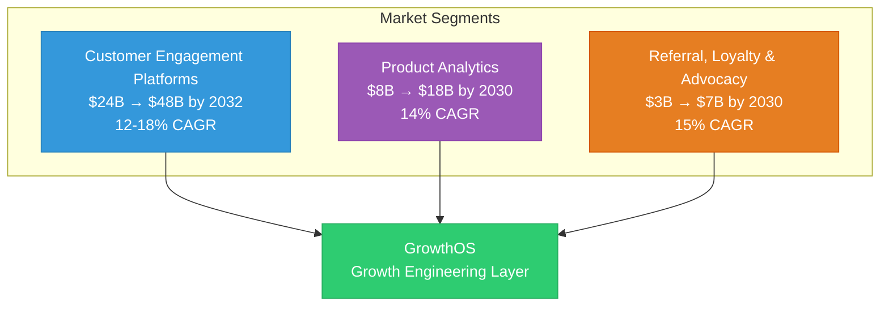
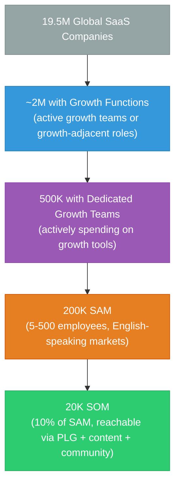
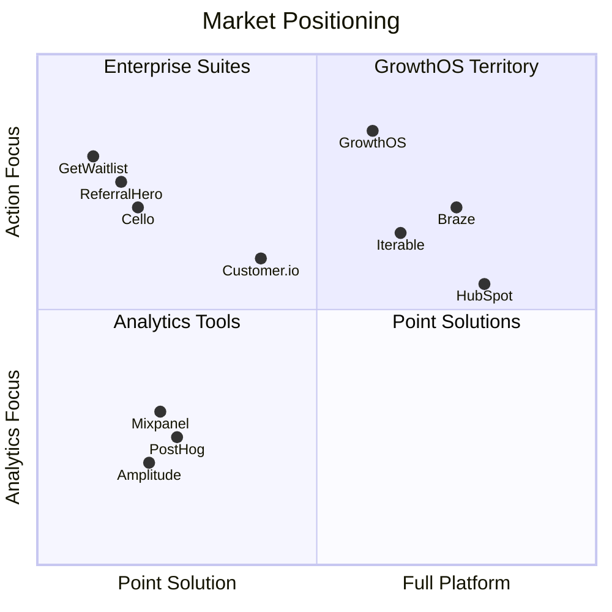

import { Card, CardGrid, LinkCard, Badge, Tabs, TabItem, Steps, Aside } from '@astrojs/starlight/components';

## Market Landscape

GrowthOS sits at the intersection of three large, growing market segments. No existing player occupies this intersection — the **growth engineering layer** between analytics and action.

---

## Market Segments

| Segment | Current Size | Projected Size | CAGR | Key Players |
|---|---|---|---|---|
| **Customer Engagement Platforms** | $24B (2024) | $48B by 2032 | 12-18% | Braze, Iterable, Customer.io, HubSpot |
| **Product Analytics** | $8B (2024) | $18B by 2030 | 14% | Amplitude, Mixpanel, PostHog, Heap |
| **Referral, Loyalty & Advocacy** | $3B (2024) | $7B by 2030 | 15% | ReferralCandy, Cello, Friendbuy, Mention Me |
| **Combined TAM** | **$35B** | **$73B by 2030-2032** | **13-16%** | — |

<Aside type="note">
GrowthOS does not need to capture a meaningful share of the entire $35B combined TAM. The opportunity is in the **underserved intersection** — companies too small for enterprise engagement platforms but too complex for individual point solutions.
</Aside>

---

## Bottom-Up Sizing

The bottom-up analysis starts with the global SaaS company count and applies progressive filters to arrive at the serviceable and obtainable markets.

### The Funnel

| Stage | Count | Filter Applied |
|---|---|---|
| Global SaaS companies | 19,500,000 | Total addressable universe |
| With growth functions | ~2,000,000 | Companies actively investing in user acquisition and retention |
| With dedicated growth teams | 500,000 | Companies spending on 3+ growth tools |
| **SAM** (Serviceable Addressable Market) | **200,000** | 5-500 employees, English-speaking markets, B2B SaaS |
| **SOM** (Serviceable Obtainable Market) | **20,000** | 10% of SAM — reachable via product-led growth, content marketing, and community |

### SAM Filters Explained

<Steps>
1. **Company size: 5-500 employees** — Below 5, companies rarely have dedicated growth spend. Above 500, they use enterprise tools (Braze, HubSpot Enterprise). The sweet spot is 5-500.
2. **English-speaking markets** — Phase 1-2 targets US, UK, Canada, Australia, and India (English-speaking tech sector). Phase 3 expands to non-English markets.
3. **B2B SaaS** — GrowthOS is purpose-built for SaaS growth patterns: trials, onboarding, activation, expansion, referrals. B2C and non-SaaS companies are excluded.
4. **Active growth tool spend** — Must be currently spending on 3+ growth tools, indicating both the need and the budget willingness. Companies not yet spending on growth tools are not ready for consolidation.
</Steps>

---

## Top-Down Sizing

The top-down approach validates the bottom-up estimate by starting with the total market and carving out GrowthOS's addressable share.

| Approach | Calculation | Result |
|---|---|---|
| 5% of Customer Engagement Platforms | 5% of $24B | **$1.2B** |
| 2% of combined TAM ($35B) | 2% of $35B | **$700M** |
| SMB segment of engagement platforms | ~15% of $24B = $3.6B, capture 5% | **$180M** |

<Aside type="tip">
The top-down and bottom-up estimates converge on a **$100M-$1.2B market opportunity** depending on penetration assumptions. For a venture-scale outcome, capturing even the low end ($100M ARR) would represent a significant business.
</Aside>

---

## Revenue Target Model

The revenue model maps the SOM to concrete ARR targets across GrowthOS phases.

<Tabs>
  <TabItem label="Conservative">
    | Metric | Value |
    |---|---|
    | Target customers | 10,000 |
    | Average ARPU | $80/mo |
    | **Annual ARR** | **$9.6M** |
    | Timeline | Phase 3-4 (Year 3-4) |
    | Penetration | 5% of SAM |
  </TabItem>
  <TabItem label="Base Case">
    | Metric | Value |
    |---|---|
    | Target customers | 20,000 |
    | Average ARPU | $100/mo |
    | **Annual ARR** | **$24M** |
    | Timeline | Phase 3-5 (Year 3-5) |
    | Penetration | 10% of SAM |
  </TabItem>
  <TabItem label="Optimistic">
    | Metric | Value |
    |---|---|
    | Target customers | 40,000 |
    | Average ARPU | $120/mo |
    | **Annual ARR** | **$57.6M** |
    | Timeline | Phase 4-5 (Year 4-5) |
    | Penetration | 20% of SAM |
  </TabItem>
</Tabs>

### ARPU Breakdown

The $100 average ARPU (base case) reflects a blended mix across tiers:

| Tier | Price | Expected Mix | Contribution to ARPU |
|---|---|---|---|
| Launch | $49/mo | 60% of customers | $29.40 |
| Scale | $149/mo | 30% of customers | $44.70 |
| Custom / Enterprise | $300+/mo | 10% of customers | $30.00+ |
| **Blended ARPU** | | | **~$104/mo** |

---

## GrowthOS Positioning

GrowthOS does not compete head-to-head with any single market segment. It occupies the **white space** at the intersection — the growth engineering layer that turns analytics insights into automated action through a unified platform.

### Why the White Space Exists

<CardGrid>
  <Card title="Analytics tools do not act" icon="information">
    PostHog, Amplitude, and Mixpanel tell you what happened. They do not send emails, run referral programs, or manage waitlists. The gap between "insight" and "action" is where growth teams lose weeks of engineering time.
  </Card>
  <Card title="Point solutions do not connect" icon="information">
    GetWaitlist, ReferralHero, and Typeform each solve one problem well. But they create 6-10 data silos with no shared identity, no cross-module workflows, and no compound data effects.
  </Card>
  <Card title="Enterprise suites are too expensive" icon="information">
    Braze, HubSpot, and Iterable offer platform-level integration — but at $500-$5,000/mo with 6-12 month implementation timelines. They are built for companies with 200+ employees and dedicated growth engineering teams.
  </Card>
  <Card title="GrowthOS fills the gap" icon="star">
    A unified platform with the **action orientation** of point solutions, the **integration depth** of enterprise suites, and the **price point** accessible to 5-200 person SaaS teams. This is the growth engineering layer.
  </Card>
</CardGrid>

---

## Key Takeaways

| Dimension | Value |
|---|---|
| **Combined TAM** | $35B (growing to $73B by 2030-2032) |
| **SAM** | 200,000 companies (5-500 employees, English-speaking, B2B SaaS) |
| **SOM** | 20,000 companies (10% of SAM) |
| **Base-case ARR target** | $24M (20K customers at $100 ARPU) |
| **Market growth** | 13-16% CAGR across all three segments |
| **Positioning** | Growth engineering layer — intersection of engagement, analytics, and advocacy |

---

## Further Reading

<CardGrid>
  <LinkCard
    title="Target Customer"
    description="The three personas that map to this market sizing."
    href="/growthos/vision/target-customer/"
  />
  <LinkCard
    title="Pricing"
    description="How Launch ($49/mo) and Scale ($149/mo) tiers capture the SAM."
    href="/growthos/business/pricing/"
  />
  <LinkCard
    title="Competitive Landscape"
    description="Detailed comparison with the key players in each market segment."
    href="/growthos/business/competitive-landscape/"
  />
  <LinkCard
    title="The Value Proposition"
    description="Why consolidation creates compound leverage that point solutions cannot match."
    href="/growthos/vision/solution/"
  />
</CardGrid>
