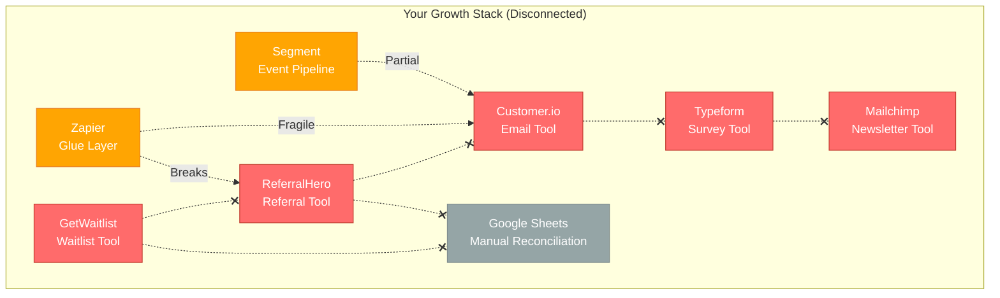
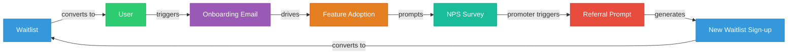

import { Card, CardGrid, LinkCard, Badge, Tabs, TabItem, Steps, Aside } from '@astrojs/starlight/components';

## Picture This

You are the growth lead at a 20-person SaaS startup. You have just closed your Series A. The board wants to see 3x growth in 12 months. You open your browser and count the tabs: **GetWaitlist** for your new feature launch, **ReferralHero** for your refer-a-friend program, **Customer.io** for onboarding emails, **Typeform** for NPS surveys, **Mailchimp** for your newsletter, **Google Sheets** for manual data reconciliation.

Each tool has its own login, its own contact list, its own definition of "user," and its own billing cycle. None of them talk to each other — not really.

Welcome to the **tool-sprawl problem**.

---

## The Stack That Nobody Wanted

Here is what a typical SaaS growth team's tool spend looks like:

| Tool | Purpose | Monthly Cost |
|---|---|---|
| GetWaitlist / Waitlist.me | Viral waitlist | $40 - $100/mo |
| Cello / ReferralHero | Referral program | $49 - $1,000/mo |
| Customer.io / Intercom | Lifecycle emails & messaging | $100 - $1,000/mo |
| Typeform / SurveyMonkey | Surveys & NPS | $25 - $83/mo |
| Mailchimp / ConvertKit | Email marketing | $30 - $300/mo |
| Segment / RudderStack | Event pipeline | $0 - $500/mo |
| Zapier / Make | Glue between tools | $20 - $100/mo |
| Google Sheets | Manual reconciliation | "Free" (but not really) |

**Total: $200 - $2,000+/mo** — and that is before the engineering cost of wiring them together.

---

## The Disconnection

Here is what this stack actually looks like in practice. Notice what is missing: **data flow between tools**.

The dashed lines with **x** marks represent data that **should** flow between tools but does not — at least not without custom engineering.

---

## The Hidden Costs

The sticker price of each tool is only the beginning. The real damage comes from what you cannot see on the invoice.

<CardGrid>
  <Card title="$15K - $260K/yr in Tool Spend" icon="seti:config">
    Six to ten separate subscriptions, each with its own pricing tier, overage charges, and annual contract traps. Costs scale non-linearly as your contact list grows — you pay for the same user across multiple tools.
  </Card>
  <Card title="$80K - $200K Integration Tax" icon="warning">
    Wiring these tools together takes 20-40 engineer-weeks at $150-$200/hr. That is your most expensive resource — engineering time — spent on plumbing instead of product. And the integrations are **fragile**: one API change breaks the chain.
  </Card>
  <Card title="Identity Fragmentation" icon="error">
    The same person exists as three different records: `jane@acme.com` in your email tool, `user_4821` in your survey tool, and `ref_jane_2024` in your referral tool. You have no single view of the customer. Segmentation is guesswork.
  </Card>
  <Card title="15 - 20% Lead Loss" icon="close">
    Leads fall through the cracks between tools. A waitlist sign-up that should trigger an onboarding email does not because the webhook failed silently. A referral conversion that should attribute correctly does not because IDs do not match across systems.
  </Card>
</CardGrid>

### The Numbers

| Hidden Cost | Impact |
|---|---|
| Direct tool spend | $15,000 - $260,000/yr |
| Integration engineering (20-40 weeks) | $80,000 - $200,000 one-time |
| Integration maintenance | $20,000 - $50,000/yr ongoing |
| Lead loss (15-20% of pipeline) | Varies — often $50K-$500K in missed revenue |
| Manual reconciliation | 3-5 hrs/week per team member |
| Context switching (6-10 tool UIs) | ~30 min/day lost productivity |

<Aside type="caution">
These numbers are based on typical Series A to Series B SaaS companies with 5-50 employees. Enterprise companies face even steeper costs — but they can afford Braze or HubSpot. The companies that suffer most are the ones in the **middle**: too big for free tiers, too small for enterprise contracts.
</Aside>

---

## What Goes Wrong

These are not hypothetical scenarios. They happen every day in growth teams running disconnected stacks.

### Scenario 1: The Detractor Who Never Got Saved

<Steps>
1. A customer submits an NPS score of **3** (strong detractor) via your Typeform survey.
2. The response sits in Typeform's dashboard. Nobody checks it for two days.
3. Meanwhile, your email tool (Customer.io) sends the same customer a cheerful "Share with a friend!" referral email — because it has no idea this person is unhappy.
4. The customer screenshots the tone-deaf email and posts it on Twitter.
5. Three other prospects see the tweet and decide not to sign up.
</Steps>

**Root cause:** The survey tool and the email tool do not share data. There is no automated workflow that says "if NPS < 6, suppress marketing emails and trigger a retention sequence."

### Scenario 2: The Referral That Did Not Count

<Steps>
1. Alice refers Bob using your ReferralHero link.
2. Bob signs up, but through a slightly different URL (he bookmarked the page and came back later).
3. ReferralHero does not see the conversion because the referral cookie expired.
4. Alice never gets her reward. She stops referring.
5. You lose the entire downstream referral chain that Alice would have generated.
</Steps>

**Root cause:** The referral tool uses cookie-based attribution that does not survive across sessions. A unified identity graph would match Bob to Alice's referral regardless of how Bob arrived.

### Scenario 3: The Waitlist Data That Died

<Steps>
1. You run a viral waitlist for your new feature. 8,000 people sign up over 3 weeks.
2. You launch the feature. The waitlist tool's job is done — you export a CSV and cancel the subscription.
3. Six months later, you want to run a survey targeting early waitlist users to understand feature adoption.
4. The CSV is somewhere in Google Drive. Half the emails have since changed. There is no way to connect waitlist position to current product behavior.
5. You send a generic survey to everyone instead. Response rate: 4%.
</Steps>

**Root cause:** Waitlist data was treated as disposable because it lived in a single-purpose tool. In a unified platform, those 8,000 contacts and their waitlist behavior would persist in the contact graph forever — enriching every future interaction.

---

## The Fundamental Issue

The problem is not that individual tools are bad. **GetWaitlist is fine. ReferralHero is fine. Customer.io is fine.** Each does its job adequately in isolation.

The problem is that **growth is not a collection of isolated activities**. Growth is a system of interconnected loops:

When these loops run on disconnected tools, they **break at every seam**. Data does not flow. Context is lost. Timing is off. The compound effect that makes growth loops powerful never materializes.

---

## There Is a Better Way

What if all of these tools shared one identity, one event stream, and one campaign engine? What if adding a referral program automatically enriched your email segmentation, and NPS responses automatically triggered the right follow-up — without a single line of integration code?

That is what GrowthOS does.

<LinkCard
  title="The GrowthOS Value Proposition"
  description="One platform, one SDK, one identity — replace 5+ disconnected tools with compound growth leverage."
  href="/growthos/vision/solution/"
/>
