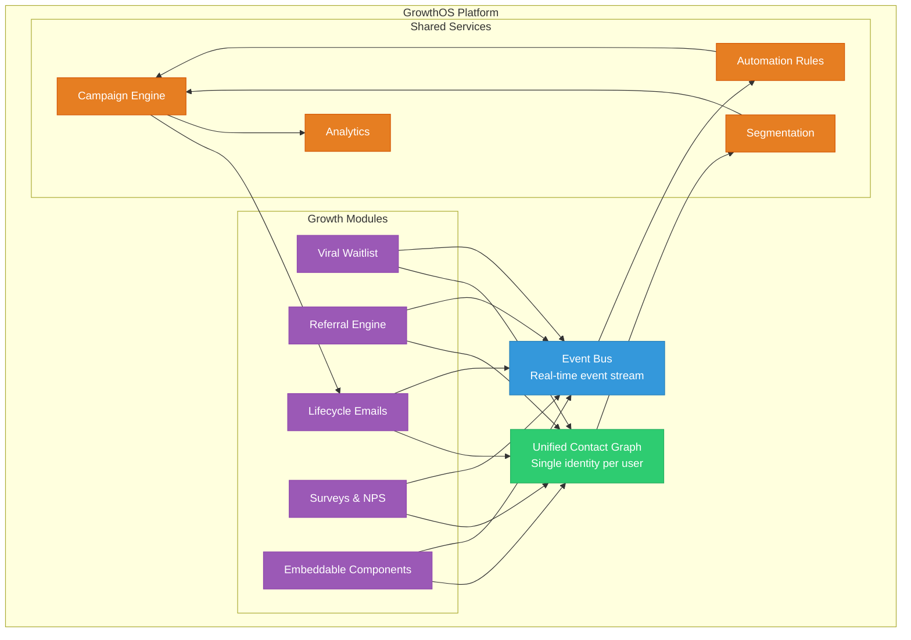
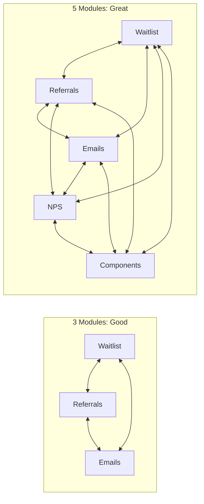

import { Card, CardGrid, LinkCard, Badge, Tabs, TabItem, Steps, Aside } from '@astrojs/starlight/components';

## One-Line Positioning

> **Replace 5+ disconnected growth tools with one integrated platform that costs less than $50/mo and integrates in under 30 minutes.**

GrowthOS is not another point solution. It is the **growth engineering layer** — a unified platform where waitlists, referrals, lifecycle emails, surveys, NPS, and embeddable components all share one contact graph, one event bus, and one SDK.

---

## Five Key Value Drivers

<CardGrid>
  <Card title="1. Consolidation Creates Compound Leverage" icon="rocket">
    Every GrowthOS module — waitlist, referrals, emails, surveys, NPS, components — shares a **unified user identity**, a **single event stream**, and a **common campaign engine**. When a waitlist user converts, the referral engine knows. When an NPS detractor responds, the email engine reacts. Data does not just coexist; it **compounds**. Each module makes every other module more effective.
  </Card>
  <Card title="2. Integration Cost Drops to Near-Zero" icon="seti:config">
    One SDK. One identity. One event schema. Instead of 20-40 engineer-weeks wiring together 6-10 tools (at $150-$200/hr, that is $80K-$200K), you install one JavaScript snippet or one npm package. Integration time: **under 30 minutes**. Your engineers go back to building product.
  </Card>
  <Card title="3. Cross-Module Workflows Become Trivial" icon="list-format">
    NPS detractor score of 3 → trigger retention email sequence → escalate to Slack channel → suppress referral prompts. In a disconnected stack, this workflow requires custom code across 3 tools plus Zapier. In GrowthOS, it is a **single automation rule** with zero custom wiring.
  </Card>
  <Card title="4. Data Compounds Over Time" icon="star">
    Referral data enriches survey targeting. NPS scores inform upgrade timing. Waitlist engagement predicts activation likelihood. Email open rates refine referral prompt timing. Every interaction feeds back into the contact graph, making every subsequent decision smarter. This is the **data flywheel** that disconnected tools cannot replicate.
  </Card>
  <Card title="5. Switching Cost Is Organic" icon="heart">
    GrowthOS does not trap you with data lock-in or proprietary formats. The switching cost is **genuine value that deepens over time**: the richer your contact graph becomes, the more effective every module gets. You stay because it works better the longer you use it — not because you cannot leave.
  </Card>
</CardGrid>

---

## How It Works

Every module connects through two shared primitives: the **Unified Contact Graph** and the **Event Bus**. This is the architecture that makes compound leverage possible.

### The Flow

<Steps>
1. **User interacts** with any module — signs up for a waitlist, completes a survey, clicks a referral link.
2. **Event fires** to the Event Bus with a standardized schema: `{ contactId, event, properties, timestamp }`.
3. **Contact Graph updates** — the user's profile is enriched with the new data point, merged with any existing identity.
4. **Automation rules evaluate** — if this event matches any trigger (e.g., "NPS < 6"), the corresponding action fires.
5. **Campaign engine executes** — sends an email, updates a segment, triggers a webhook, posts to Slack.
6. **Analytics record** — every action and outcome is tracked, feeding back into segmentation and optimization.
</Steps>

All of this happens **automatically**, with no custom integration code. Adding a new module to your GrowthOS instance immediately connects it to every existing workflow.

---

## The Compound Effect

The value of GrowthOS is not linear — it is **exponential** in the number of modules you use.

| Modules Active | Connections | Example Compound Workflow |
|---|---|---|
| **2** (Waitlist + Referrals) | 1 | Referral bumps waitlist position |
| **3** (+ Emails) | 3 | Waitlist conversion triggers onboarding drip; referral milestones trigger reward emails |
| **4** (+ NPS) | 6 | NPS detectors suppress referral prompts; promoters get fast-tracked to referral program |
| **5** (+ Components) | 10 | Embeddable referral widget auto-personalizes based on NPS score and waitlist cohort |
| **8** (all modules) | 28 | Full growth loop: every touchpoint informs every other touchpoint |

<Aside type="tip">
At 3 modules, you get clear value — tool consolidation and basic cross-module workflows. At 5+ modules, you get **disproportionately more value** because the number of useful data connections grows combinatorially. This is the compound leverage that no collection of point tools can replicate.
</Aside>

---

## Cost Comparison

<Tabs>
  <TabItem label="Indie SaaS (5-50 people)">
    | Dimension | Disconnected Stack | GrowthOS Launch |
    |---|---|---|
    | Monthly tool spend | $200 - $800/mo | **$49/mo** |
    | Annual tool spend | $2,400 - $9,600/yr | **$588/yr** |
    | Integration effort | 10-20 engineer-weeks | **< 30 minutes** |
    | Integration cost (one-time) | $40,000 - $100,000 | **$0** |
    | Ongoing maintenance | $10,000 - $25,000/yr | **$0** |
    | **Total Year-1 Cost** | **$52,400 - $134,600** | **$588** |
  </TabItem>
  <TabItem label="Mid-Market SaaS (50-200 people)">
    | Dimension | Disconnected Stack | GrowthOS Scale |
    |---|---|---|
    | Monthly tool spend | $800 - $2,000/mo | **$149/mo** |
    | Annual tool spend | $9,600 - $24,000/yr | **$1,788/yr** |
    | Integration effort | 20-40 engineer-weeks | **< 1 hour** |
    | Integration cost (one-time) | $80,000 - $200,000 | **$0** |
    | Ongoing maintenance | $20,000 - $50,000/yr | **$0** |
    | **Total Year-1 Cost** | **$109,600 - $274,000** | **$1,788** |
  </TabItem>
</Tabs>

<Aside type="note">
These estimates assume typical SaaS team sizes and prevailing contractor/employee rates for growth engineering work ($150-$200/hr). Your actual savings will vary based on current stack complexity and team size.
</Aside>

---

## What Comes Next

<CardGrid>
  <LinkCard
    title="Target Customer"
    description="Who GrowthOS is built for — primary, secondary, and tertiary personas."
    href="/growthos/vision/target-customer/"
  />
  <LinkCard
    title="Platform Architecture"
    description="Deep dive into the unified contact graph, event bus, and module system."
    href="/growthos/platform/architecture/"
  />
  <LinkCard
    title="Phase 1 Overview"
    description="The first milestone: viral waitlist, referral engine, and lifecycle emails."
    href="/growthos/phase-1/overview/"
  />
  <LinkCard
    title="Competitive Landscape"
    description="How GrowthOS compares to Braze, HubSpot, and point solutions."
    href="/growthos/business/competitive-landscape/"
  />
</CardGrid>
